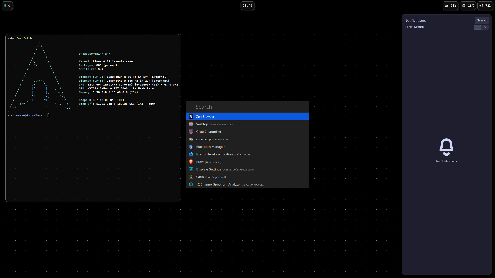

# Hyprland Dotfiles
### Apps / Configurations:
- ZSH (oh-my-posh)
- Waybar
- Rofi
- Hyprlock
- Alacritty

## Installation
1. `cd ~/.config`, move into your config directory
2. `mv hypr hypr.bak`, create a backup of your files. Do this in a TTY and more importantly logout of Hyprland or else Hyprland will create a new default configuration!
3. `git clone https://github.com/FerrousInk/dotfiles hypr`, clone the dotfiles in place of the last dotfiles

#### ZSH Configuration
4. `nano ~/.zshrc`, add `source ~/.config/hypr/apps/zsh/zshrc` and press Ctrl+S and then Ctrl+X
5. Open a new Terminal and wait until the prompt is displayed

## Pictures

