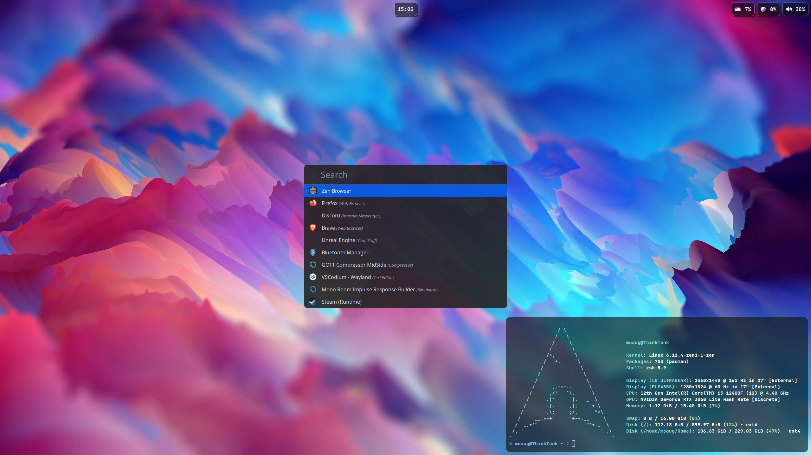

# Hyprland Dotfiles
### Apps / Configurations:
- NU (starship)
- ZSH (starship)
- Waybar
- Rofi
- Hyprlock
- Alacritty

## Installation
1. `cd ~/.config`, go into your config directory
2. `mv hypr hypr.bak`, create a backup of your files. Don't do this inside Hyprland or else the default configuration will be recreated!
3. `git clone https://github.com/FerrousInk/dotfiles hypr`, clone the dotfiles
4. Install the dependencies you want
- ~/.config/hypr/deps/hyprland.sh
- ~/.config/hypr/deps/terminal.sh
- ~/.config/hypr/deps/audio.sh

#### ZSH Configuration
1. `nano ~/.zshrc`, add `source ~/.config/hypr/apps/zsh/zshrc` and press Ctrl+S and then Ctrl+X
2. Open a new Terminal and wait until the prompt is displayed

#### Good Audio
1. `nano ~/.config/hypr/hyprland.conf` and uncomment `exec-once = [ workspace special:magic silent ] carla`, this will start carla everytime you login

## Pictures

